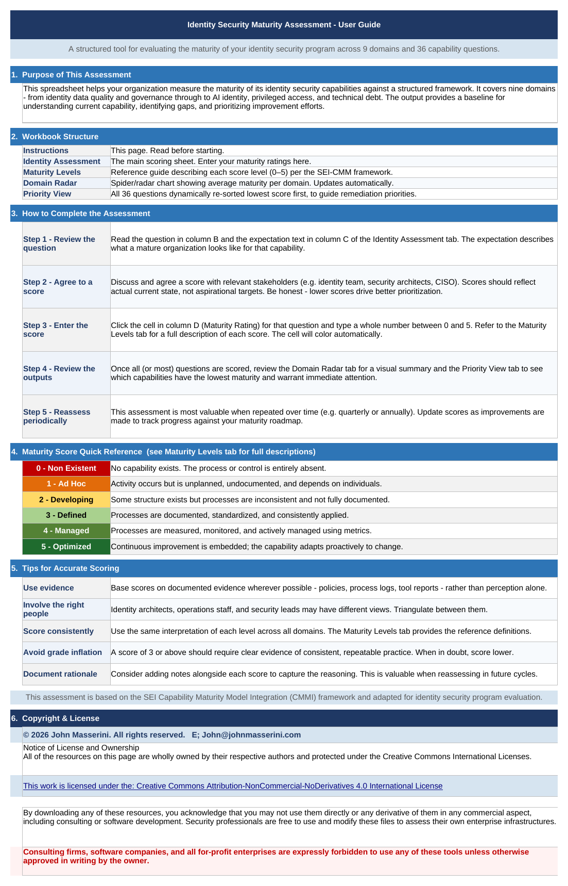
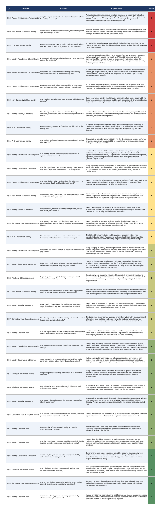

# Identity Program Maturity Calculator (2026)

A structured Excel-based framework for evaluating the maturity of an organization's identity security program across nine capability domains and 36 assessment questions. Built on the SEI Capability Maturity Model Integration (CMMI) framework, this tool enables security teams to baseline their current identity security posture, identify capability gaps, and prioritize remediation efforts using a consistent, repeatable methodology.
> This worksheet is the product of applied identity security program experience, adapted specifically for the realities of modern identity estates, human, machine, and increasingly, AI and agentic identities.
The assessment covers Identity Foundations & Data Quality, Governance & Lifecycle, Access Architecture & Authentication, Privileged & Elevated Access, Non-Human & Workload Identity, Identity Security Operations, Contextual Trust & Adaptive Access, AI & Autonomous Identity, and Identity Technical Debt.

Each capability is scored on a 0–5 maturity scale. Results are visualized through a radar chart showing average maturity by domain and a dynamic priority view that automatically surfaces the lowest-scoring capabilities for immediate attention.

Designed for identity architects, security engineers, and CISOs conducting internal assessments or program reviews. 

Licensed under Creative Commons Attribution-NonCommercial-NoDerivatives 4.0 International. Free for use by security professionals assessing their own enterprise environments.

---
## Download

The latest version of the workbook is available on the [Releases](https://github.com/SentiConSecurity/Identity_Maturity_Calculator/releases) page as `Identity_Maturity_Assessment.xlsx`. 
> Download the file directly — do not rely on the auto-generated source-code archives, which do not contain the spreadsheet.
## What It Measures

The assessment covers **9 domains** and **36 questions** (4 per domain):

| # | Domain | Focus |
|---|--------|-------|
| 1 | Identity Foundations & Data Quality | Authoritative inventory, correlation, systems of record, data quality |
| 2 | Identity Governance & Lifecycle | Joiner/mover/leaver automation, role models, certifications, accountability |
| 3 | Access Architecture & Authentication | Authentication visibility, phishing resistance, federation, consistent enforcement |
| 4 | Privileged & Elevated Access | Just-in-time privilege, attribution, session monitoring, risk-based controls |
| 5 | Non-Human & Workload Identity | Machine/service/API inventory, secrets lifecycle, ownership, permission review |
| 6 | Identity Security Operations | Real-time change detection, compromise monitoring, ITDR, posture management |
| 7 | Contextual Trust & Adaptive Access | Dynamic risk-based access, additional trust signals, correlation, low-friction security |
| 8 | AI & Autonomous Identity | AI agent governance, policy-based restriction, auditability, governed autonomy |
| 9 | Identity Technical Debt | Debt quantification, repository consolidation, automation, business impact |

Each question is scored **0–5** against a common maturity scale:

| Score | Level | Description |
|:-:|---|---|
| 0 | Non Existent | No process or control exists. |
| 1 | Ad Hoc | Unpredictable, reactive. Depends on individuals. No repeatability. |
| 2 | Developing | Basic structure exists. Inconsistent across the organization. |
| 3 | Defined | Documented and standardized. Consistently applied enterprise-wide. |
| 4 | Managed | Quantitatively measured and actively managed using metrics. |
| 5 | Optimized | Continuous improvement embedded. Adapts proactively to change. |

---
## Workbook Structure

| Tab | Purpose |
|---|---|
| **Instructions** | User guide, scoring instructions, maturity quick-reference, and copyright notice. |
| **Maturity Levels** | Full reference table mapping scores 0–5 to SEI-CMM level names and descriptions. |
| **Identity Assessment** | Main scoring sheet. 36 questions across 9 domains — enter scores in column D. |
| **Domain Radar** | Spider/radar chart showing average maturity per domain. Updates automatically. |
| **Priority View** | All 36 questions dynamically sorted lowest-score-first, to drive remediation priority. |

The workbook also contains a hidden `_helper` sheet used internally to power the Priority View sort — it should not be deleted, renamed, or unhidden during normal use.

---
## How to Use It

1. Download the workbook from [Releases](https://github.com/SentiConSecurity/Identity_Maturity_Calculator/releases).
2. Open the **Instructions** tab and read the user guide.
3. Review each question on the **Identity Assessment** tab — the question in column B and the expectation in column C describe what a mature organization looks like for that capability.
4. Agree a score (0–5) with the relevant stakeholders (identity team, security architects, CISO) and enter it in column D. Score current state, not aspirational targets.
5. Review the **Domain Radar** tab for a visual summary and the **Priority View** tab to see which capabilities warrant the most immediate attention.
6. Reassess periodically (e.g. quarterly or annually) to track progress against your maturity roadmap.

Full guidance, including tips for consistent and defensible scoring, is in the [wiki](https://github.com/SentiConSecurity/Identity_Maturity_Calculator/wiki).

---
## Documentation

- [Wiki Home](https://github.com/SentiConSecurity/Identity_Maturity_Calculator/wiki) — full usage guidance, philosophy, and references
- [Directions](https://github.com/SentiConSecurity/Identity_Maturity_Calculator/wiki/Directions) — step-by-step instructions for completing the assessment
- [Maturity Levels](https://github.com/SentiConSecurity/Identity_Maturity_Calculator/wiki/Maturity-Levels) — how to interpret and, if needed, customize the maturity scale
- [Rationale](https://github.com/SentiConSecurity/Identity_Maturity_Calculator/wiki/Rationale) — the methodology and reasoning behind the framework's design
- [References](https://github.com/SentiConSecurity/Identity_Maturity_Calculator/wiki/References) — source frameworks and further reading
- [CHANGELOG](CHANGELOG.md) — version history

---
## Screenshots

### Instructions

### Priority View

---
## License

© 2026 John Masserini. All rights reserved.

This work is licensed under the **Creative Commons Attribution-NonCommercial-NoDerivatives 4.0 International License (CC BY-NC-ND 4.0)**.

By using these resources, you acknowledge that you may not use them, or any derivative of them, in any commercial aspect, including consulting or software development. Security professionals are free to use and modify these files to assess their own enterprise infrastructures.

**Consulting firms, software companies, and all for-profit enterprises are expressly forbidden to use any of these tools unless otherwise approved in writing by the owner.**

See [LICENSE.md](LICENSE.md) for the full license text, or [creativecommons.org/licenses/by-nc-nd/4.0](http://creativecommons.org/licenses/by-nc-nd/4.0/).

## Related Projects

- [NIST_CSF_Maturity_Tool](https://github.com/SentiConSecurity/NIST_CSF_Maturity_Tool) — the companion maturity toolkit for NIST Cybersecurity Framework 2.0 program assessment.

## Disclaimer

This toolkit is provided "as is," without warranty of any kind. Users bear all risk and responsibility for their own regulatory compliance. The author disclaims liability for damages or issues arising from its use.
